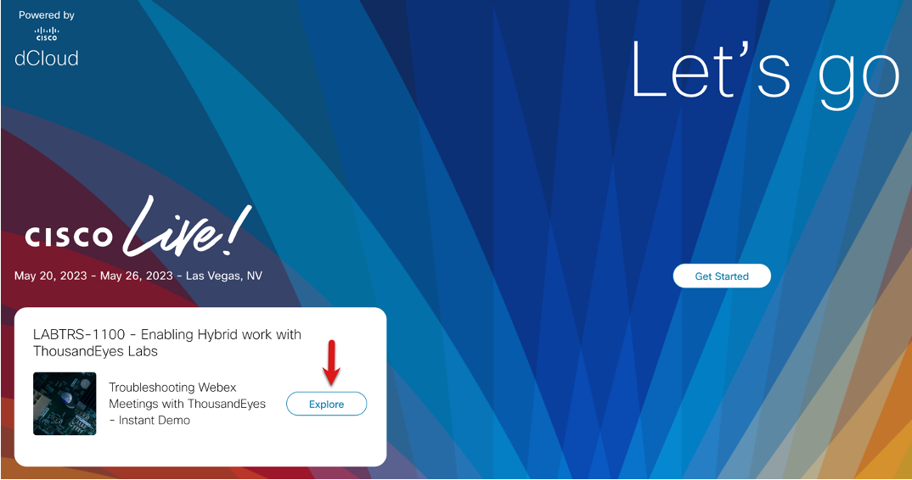
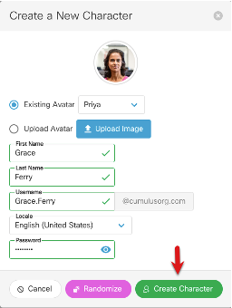
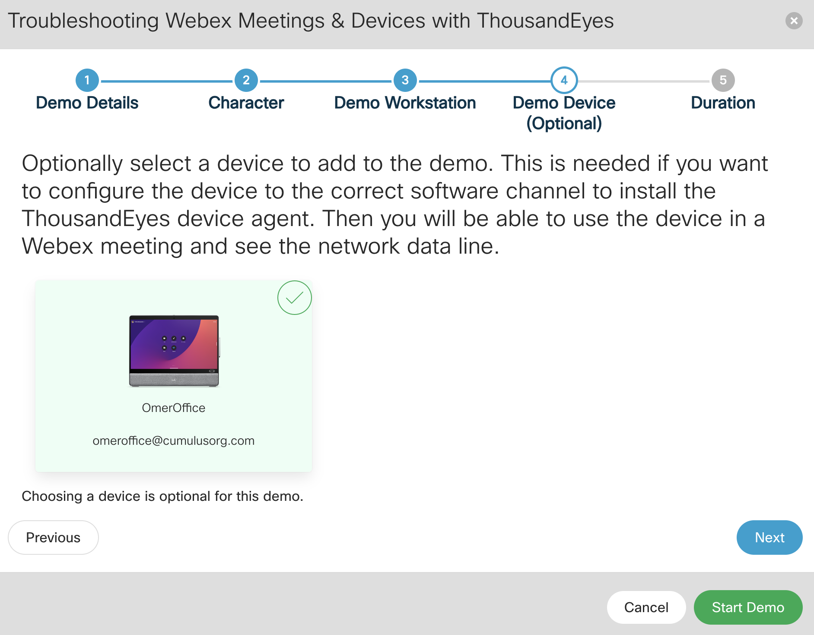
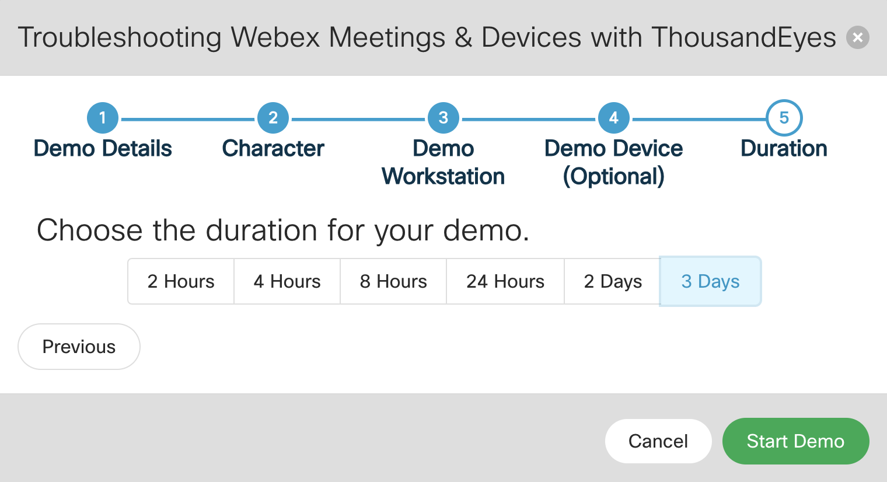

# Task 1: Lab Login and Setup

Click to access the [lab](https://demotoolbox.cat-dcloud.com/)

<!-- Click **Explore** as shown in the screenshot below to begin your adventure with Hybrid Work monitoring using the ThousandEyes Endpoint Agent -->

<!--  -->

<!-- * Enter your Email Address -->
<!-- * Click to Agree to the terms and conditions -->
<!-- * Click Continue -->

<!-- Click Launch to start the **Troubleshooting Webex Meetings with Thousandeyes - Instant Demo** lab -->

<!--  -->

This lab requires a set of characters which will be aligned with roles to access ThousandEyes and Webex. **Optional** you can also register your Webex device on the platform that can be used with your demo.

Click **My Characters** then click **Add New Character** as shown in the below image. You only need to create one character for the lab.

Click **Create Character**.  Note (They will be randomly created so yours may not match the below screenshot. Also you have an option to modify the names as per your preferences.)

**Optional Step** Click on the My Devices tab, select Add New Room Device, if you want your device to be available in the demo and thousandEyes agent installed on your device. Please remember its an optional step.

Make sure you are on your [demo page](https://demotoolbox.cat-dcloud.com/demo/demo-troubleshooting-with-webex-and-thousandeyes) Click **Start Demo** (you may have to use the back arrow to navigate back to the main overview page)

Next we need to provide a few details in order for the lab to be spun up.

* **Audience:** External
* **External Type:** Trade Show
* **Tradeshow Name:** Roadshow
* **Demo Session Name:** Enter your name – or leave it default

Click **Next** and then choose the character you created previously.
(Note: this will be needed for automated session testing - AST)

Click **Next** and add a virtual workstation using the '+" sign. This will be used to install the ThousandEyes Endpoint Agent (EPA) which can be configured to monitor web browser sessions, automtically monitor dynamic Webex meeting network connections and run scheduled tests in the background. **Note** you also have an option to install the [ThousandEyes agent](https://demotoolbox.cat-dcloud.com/demo/demo-troubleshooting-with-webex-and-thousandeyes#:~:text=DEMO%20DOWNLOADS%20AND%20LINKS) on your personal machine

**Optional Step**  If you have a Webex device select your device and click **Next** 

Click **Next** select your duration and Click **Start Demo** as shown in the below screenshot.

This is roughly a 45 min lab but the access duration can be upto 3 days. It will take a few minutes for the lab to spin up.
While this is occurring proceed on to the ThousandEyes Overview content and extra background information in [Task 2](./Task2.md).

