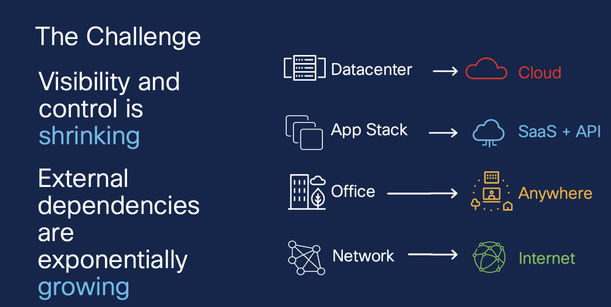
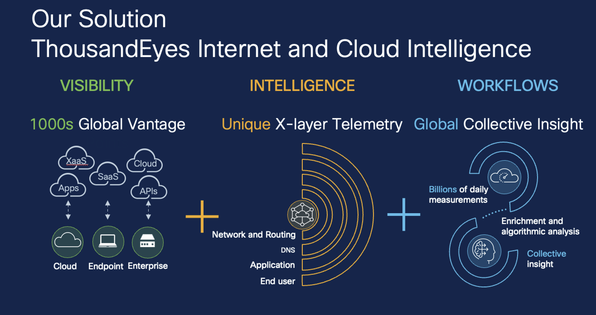

# Task 2: ThousandEyes Overview

Feel free to take a few minutes while the lab spins up and review the [Getting Started with Endpoint Agents](https://docs.thousandeyes.com/product-documentation/getting-started/getting-started-with-endpoint-agents) guide.

Connectivity is your business, but it’s changing rapidly. Your brand is only as good as your network.​ Digital experience is how you are measured, but most of the path is outside your control (outside the core)​ What do you need to do about it?​ How can you understand digital experience to the things your customers are accessing​ and understand health of the Internet cloud and peering providers. Continue your journey to learn how ThousandEyes can help answer these questions and help solve your network and application acceess issues.

Now that you have a great background on ThousandEyes it's time to go back and verify the lab has started and login. [Task 3](./Task3.md).

Also feel free to check our awesome [TE Blog](https://www.thousandeyes.com/blog/) and [Webex site](https://help.webex.com/en-us).