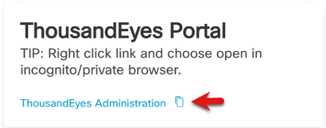
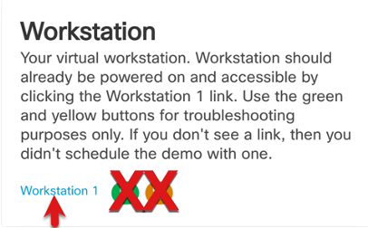
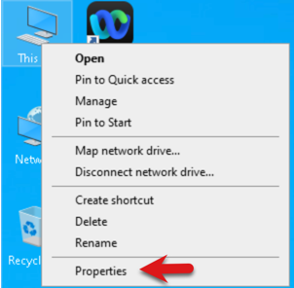
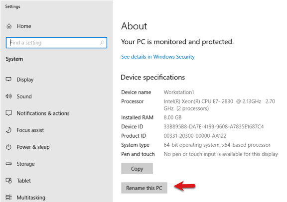
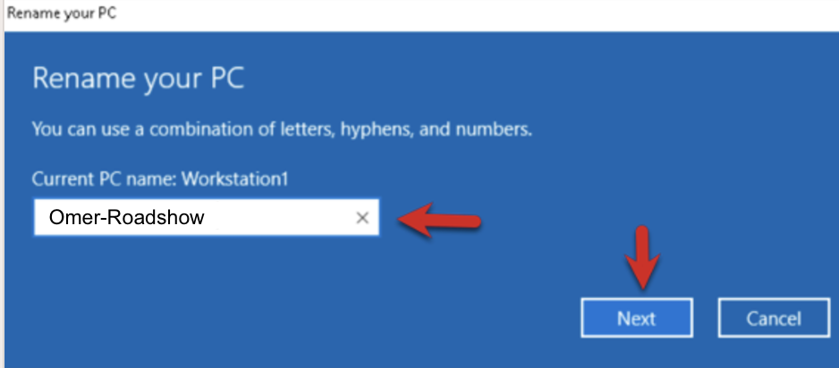
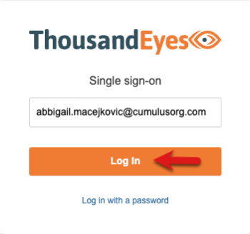
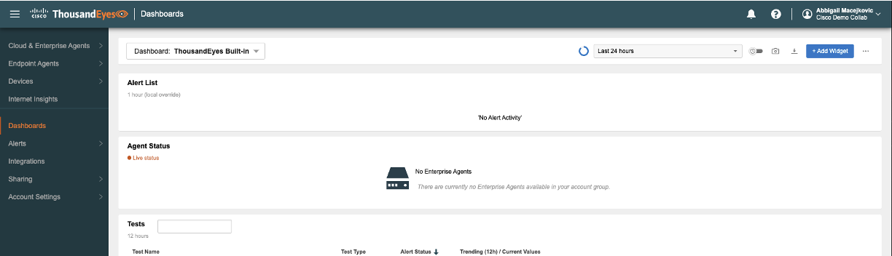
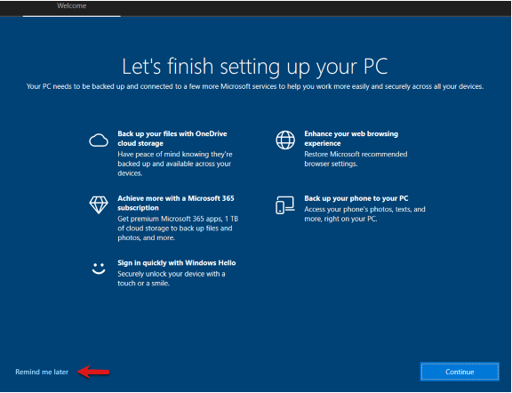

# Task 3: Log into the Lab Environment

Click **My Demo Sessions** select your **ThousandEyes** demo and click the **green View button**

Lab Administration Information (New Read Only Admin User)

* Webex Control Hub/ThousandEyes Admin Access - A new **read only** admin user will be created. This is the new user you'll use to access the Webex ControlHub and ThousandEyes Platform
(**Note:** Your user will most likely be different than this one as they are radomly assigned.)
  * Email Address will be used for the SSO login access as well as the Password

* Access information to the Webex ControlHub Portal -  right click and use an **Incognito Browser**

* Access information to the ThousandEyes Portal be sure to right click and use an **Incognito Browser**

<!-- * Access to the lab Windows VM

 -->

First thing will be to get your VM set up

* Click the Workstation 1 link. You should see a Windows Desktop show up in new browser tab.

Right Click on the **This PC** desktop icon and click **Properties** so you can rename the VM.

Click Rename this PC

Name the PC your-name-Roadshow (no spaces), click **Next** and click **Restart Now**

While the VM reboots go back to your previous tab for demo . Right click the **Control Hub URL** and **ThousandEyes Administration** Portal link and open both in incognito browsers as we will be using them in the coming steps. The same creds can be used to login into Webex Control Hub and ThousandEyes  

Use the credentials from the ControlHub/ThousandEyes Read Only Admin in the next steps.

Your incognito browser will open to the ThousandEyes SSO login page as shown in the below image. Use the Username and Password from the ThousandEyes Read Only Admin to complete the login process. Click Don’t show this again and Yes in the pop up window after you have completed the SSO login process.

You should now see the ThousandEyes Default Dashboard (see the below image). You can leave this browser open and we will come back to it later.

**Note:** Follow the above creds/steps to login into Webex Control Hub as we will be using them in coming steps.

Log back into the Windows VM. Navigate back to the tab that had the Windows VM running in it and click “Reconnect” or if that tab closed you click on the Workstation 1 link to open a new session to it.

Note if a Let’s finish setting up your PC window appears just click ”Remind me Later". Also close the CC Cleaner browser and Accept the Webex EULA (if they appear).

Time to install the ThousandEyes Endpoint Agent (EPA) continue to [Task 4](./Task4.md).

