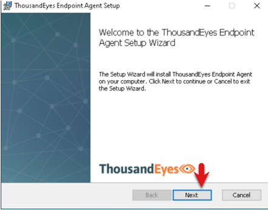
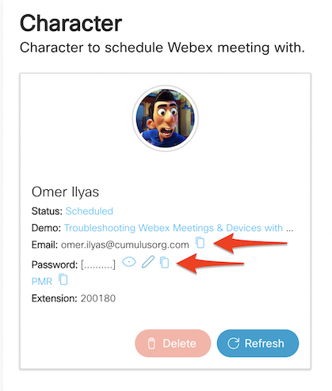
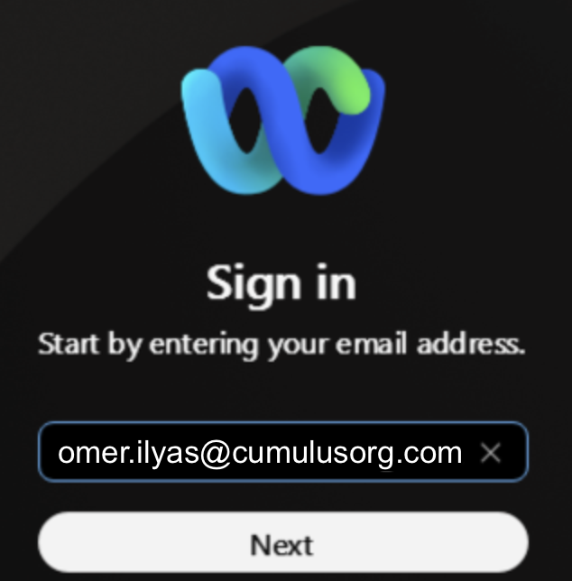
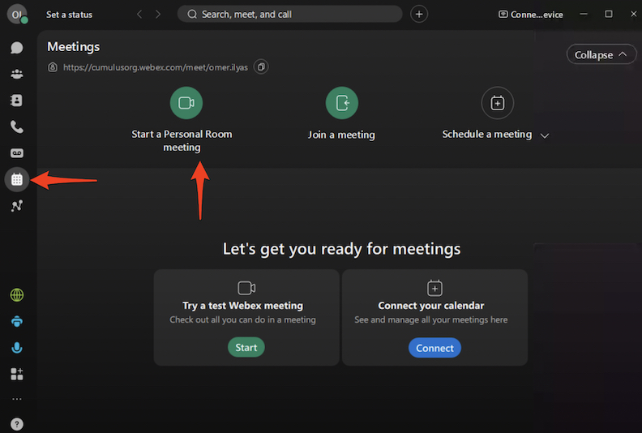
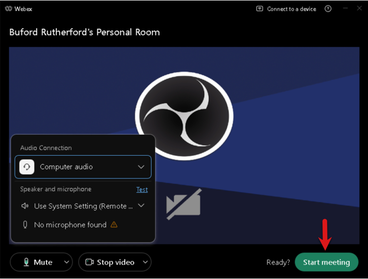
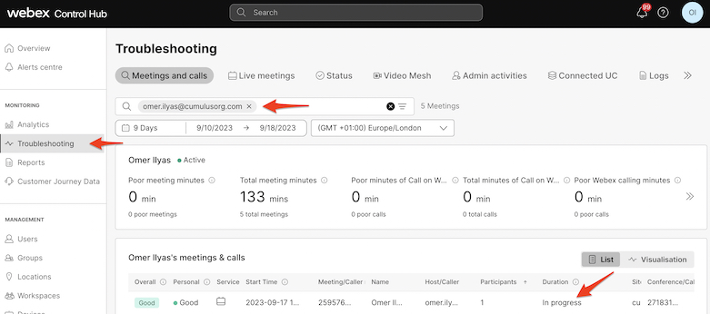

# Task 4: Install the ThousandEyes EPA

Once on your VM station,make sure no browser sessions are running on Window VM then click the ThousandEyes Agent Installer

You should **NOT** have to do this but if you don’t see the ThousandEyes Agent Installer go back to the tab for the lab and click the **Instructions link** then copy the link for the **Windows x64 Agent Install (MSI) – Full** from the Demo Downloads and Links section. Navigate back to the Windows VM tab, open a browser and paste the link into it to download the installer. Locate the installer and click it to install it.

Click **Next** and Accept the License Agreement

Click the disk icon for **ThousandEyes Endpoint Agent** and **Google Chrome** and select **Entire feature will be installed on local hard drive** then click **Next** and **Finish**.

**Note** the above step will install ThousandEyes Endpoint agent on the VM provided. As mentioned earlier you can also get the install file from the **Instruction** tab and install the same on your personal machine (windows/mac)

## Start up a Webex Meeting on your VM

This will generate Webex traffic which we will view later in the lab. Navigate back to your lab information tab. Copy the email address for the character you **created** to schedule a Webex meeting with. You will use this to login into Webex App and start a Webex meeting session.

Navigate back to your VM web browser tab and click on the Webex icon then sign in using the email address and password from your character.

Click the **Webex icon** on the task bar. Click **Meetings**. Click **Start a Personal Room meeting**. 
**Note** Your WebexApp might do a quick update.

Click **Join meeting** and then click **Start meeting**.

<!-- Click **Ok** on the Microphone Not Available. Click OK on **Others can’t hear you**

 -->

This will generate Webex traffic which you will view later in the lab. **Note:** Since no one is joining the meeting it may have a pop up after a while warning the meeting will end unless you click to keep it active. Feel free to click to keep it active or you can add another participant in that meeting or you can always go back and **Start a Personal Room Meeting** again.

## Login to Webex ControlHub

Once the user join a meeting you can login into Webex Control Hub using the (read only admin) credentials provided.  

Click on **Troubleshooting** search for your **userid** that you have used to join the Webex meeting.

## Locate your ThousandEyes EPA

By now you have your ThousandEyes Endpoint Agent running. Let’s verify it has connected to the ThousandEyes Platform.

Navigate back to your incognito browser that is logged into ThousandEyes.

Click **Endpoint Agents > Agent Settings** (if you were already in the tab you may have to click **refresh**)

Search for your EPA 

* In the search bar type the name you gave your VM (if it doesn’t show up contact a lab proctor). Also verify that the Google Chrome Browser Extension shows up as shown in the below screen shot.

If your Google Chrome Browser Plug-in didn’t install. (Note sometimes it take a minute to show up. Please refresh the browser.) Navigate back to your **VM** and click on the **Google Chrome** icon on the task bar.

* Install the Google ThousandEyes Google Chrom Plug-in by pasting this [link](https://chrome.google.com/webstore/detail/thousandeyes-endpoint-age/ddnennmeinlkhkmajmmfaojcnpddnpgb) in your Google Chrome Browser
* https://chrome.google.com/webstore/detail/thousandeyes-endpoint-age/ddnennmeinlkhkmajmmfaojcnpddnpgb

If asked Turn on Sync. Navigate back to the incognito browser logged into ThousandEyes and your ThousandEyes EPA should look like the one below.

You are now ready to continue your journey see how AST (Automated Session tests) can automatically monitor Webex meetings. Customize and see how your EPA monitors browser sessions and set up scheduled tests to montior the health of critical applications in the background. Scheduled tests are a great way to provide a baseline for application and network health. The browser sessions provide the view of what the end users session is like when sites are accessed in the domains you are interested in monitoring. And Automated sessions tests will integrate with Webex and monitor traffic automatically whenever a user joins a Webex meeting from Webex App or the RoomOS devices. Let's carry on with [Task 5](./Task5.md).

