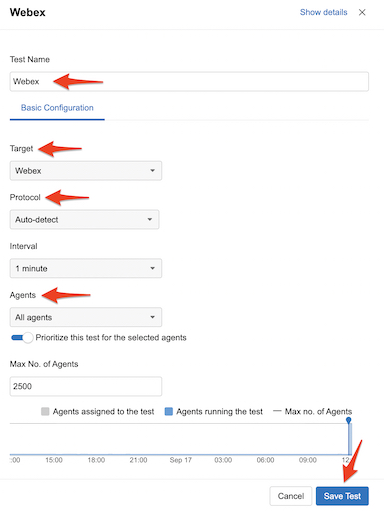
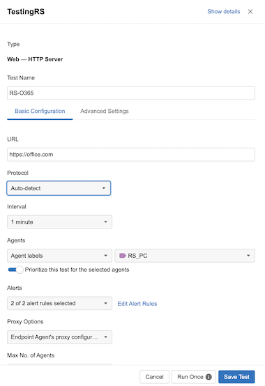

# Task 5: Configure ThousandEyes Automated Session tests and EPA Monitoring

## Set up Automated Session tests for Webex Meetings - Optional Step

**Automated Session Tests** enable the Endpoint Agents installed on your  workstations to monitor and identify network connections between a user’s application and the destination node (Webex); thereby, removing the ambiguity of knowing whether the IP addresses created in synthetic tests are going to the right datacentre or service.
Automated Session Tests capture the performance of a desktop application e.g. Webex App, without you having to manually configure an IP address or hostname for the application.

**Note:** The below configuration steps are for information purpose only

* Navigate to the Endpoint Agents > Monitoring Settings > Automated Session Tests tab.
* Click the Add New Test button.

* Create an AST to monitor Webex Meetings in your organization  

**Note:** The above steps have already been configured. Showing for **information purpose** only. 

**Note:** More info can be found on [Webex help](https://help.webex.com/en-us/article/nymfj2d/Integrate-ThousandEyes-with-Troubleshooting-in-Control-Hub) that explains how to create a configuration between ControlHub and ThousandEyes platform.

When the user (that was created by you) initiate and join a Webex meeting from the WebexApp, you be able to view the ThousandEyes path in ControlHub troubleshooting section.

* If you have logged out, log back in ControlHub using Readonly admin creds provided . Click on Troubleshooting,  search for your userid that you have used to join the Webex meeting and click the meeting that is in progress.

**Note** Make sure the Webex meeting is still going on in the virtual machine. As you are the only participant, it will disconnect in some time. If disconnected, please start the meeting again.

* Click your demo user id

* You will notice ThousandEyes path. **ThousandEyes AST** starts capturing network path data as soon as the meeting starts. However, there could be a delay of up to five minutes before that data populates in Troubleshooting section. 

* The network path route shows the details for each node that the hop connected to. Click on any of the dotted lines 

* You can hover over a dotted line to see the user's latency (round-trip) average value during that interval. The color changes depending on the threshold that the value met. Thresholds in Webex are are calculated as:

        - Poor (red)—Latency > 400ms or Loss (round-trip) > 5%
        - Good (green)—Latency < 300ms or Loss (round-trip) < 3%
        - Fair (yellow)—Neither of the above.
        - Unknown (grey)—Not available yet. You still be able to retrieve the metric from the TE dashboard.

* You can also click on **Launch the ThousandEyes dashboard** . It will cross-launch from the Webex ControlHub Network Path into ThousandEyes platform. You will be navigated to the Automated Session Tests view, which is found within the **Endpoint Agents > Views > Automated Session Tests** section of the web application. The view is pre-filtered to the corresponding user and time segment from Webex Control Hub.

## Understanding Scheduled tests 

Before setting up scheduled tests it's a good idea to create an Agent Label and assign your EPA to it. Labels are a super powerful way to dynamically manage how ThousandEyes Endpoint Agents are configured for testing and reporting.

For more information on Endpoint Agent Labels check out our [documentation](https://docs.thousandeyes.com/product-documentation/global-vantage-points/endpoint-agents/configuring/configure-endpoint-agent-labels).

Click the **Agent Labels** if you are still viewing your EPA otherwise navigate to **Endpoint Agents > Agent Settings > Agent Labels**.

Click **Add New Label**. Name the label e.g RS_PC, select any color.

In the Filter section select **Agent** **in** and use the pull down to select your agent (note you can use the search field to quickly find your agent). Click **Save**. See the image below for and example of how to add your agent to your label.

## Set up Scheduled Tests for your ThousandEyes EPA

You will build a test that will run every minute to https://office.com for this lab but feel free to build other tests. You can have up to 10 tests run on an EPA.

Navigate to **Endpoint Agents > Monitoring Settings**

Click **Add New Test**

* Type Web, HTTP Server (this is the default)
* Test Name: Set a unique name
* URL: https://office.com
* Interval: 1 minute
* Agents: Agent label then select the label you created
* Click the prioritize slider (as this is an important test)
* Click **Add New Test** (note you can also Run Once but if you do this don’t forget to save the test!)

## Set up Browser Sessions for your ThousandEyes EPA

Set up domains to be monitored when the browser on the Windows VM accesses them (Note: Only Chrome, Edge or IE 11+ browsers are supported). Typically these consist of the domains that are critical for your users and businses operations. You'll see shortly how powerful this can for troubleshooting users issues. 

Navigate to **Endpoint Agents > Monitoring Settings > Browser Sessions**. For more information on Browser Session monitoring click [here](https://docs.thousandeyes.com/product-documentation/end-user-monitoring/browser-session/configure-browser-session).

Click **Add New Monitored Domain Set**

* Domain Set Name: Set a unique name
* Monitored Domains: office.com, webex.com, cisco.com (feel free to add in other domains)
* Agents: Agent Labels and select your agent label that you created earlier  
* Click **Add New Monitored Domain Set**

## Automated Sessions Tests (AST) for your ThousandEyes EPA

<!-- Please do not make changes to the AST that is configured. **This is for informational purposes only.**

Navigate to **Endpoint Agents > Monitoring Settings > Automated Session Tests**

Click **Add New Test**

Click the **Target Pull Down**. Review the list applications then click **Cancel** -->

<!-- 

Automated Session Tests make it easy to monitor dynamic sessions that are created by applications. Today, Microsoft Teams, Webex, Webex Calling and Zoom are out of the box. If you have a custom dynamic application you’d like to have monitored please reach out to your ThousandEyes TSA or support and let us know so we can collaborate with you and craete it. -->
## Navigate back to your VM

Open the Chrome Browser and navigate to the domains you set for browser sessions. Open a tab and bring up a site in each tab:

* https://cisco.com
* https://webex.com
* https://office.com

Click refresh on each tab a few times to create some extra sessions. Do this for a few minutes randomly to generate web browser traffic which we will analyze later. If you need to test out having browser traffic randomly generated to a site or set of sites a great chrome plug in to use is [Auto Refresh Plus](https://autorefresh.io/). We won't go into configuring or installing it for this lab.

You should have some good data captured with the Webex session running in the background on the VM being catpured with the Webex AST, the scheduled tests runing in background providing a baseline and then the browser sessions. Time to move onto [Task 6](./Task6.md) and start analyzing the data!

