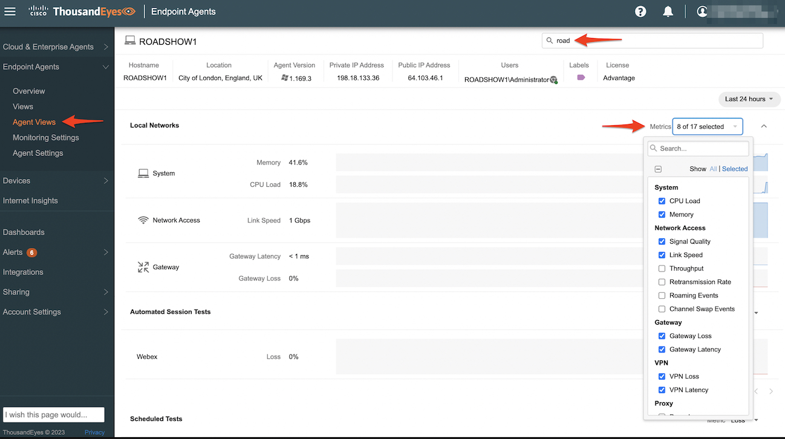
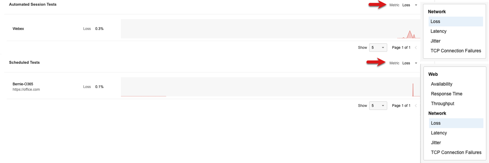
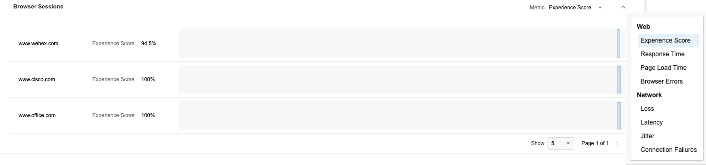
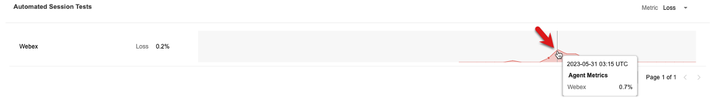
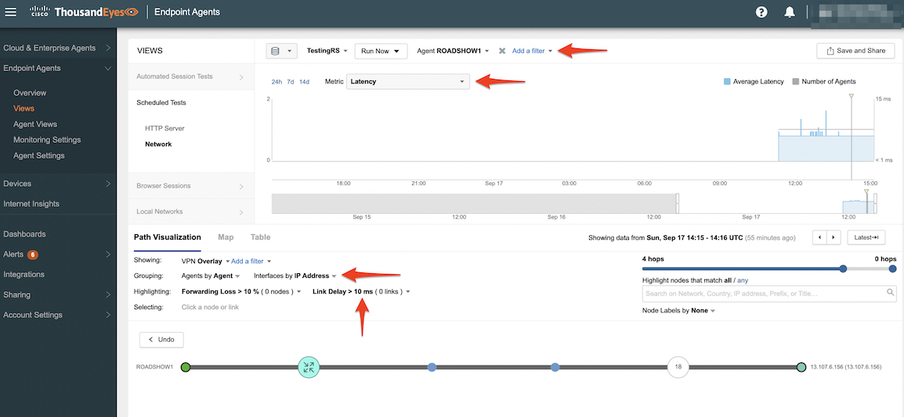
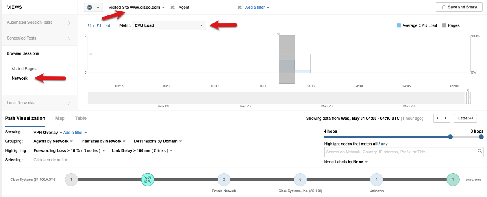
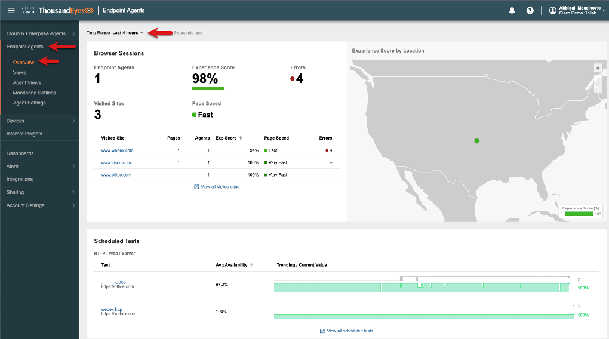

# Analyzing ThousandEyes EPA Data

Typically when a user experiences an issue they will either suffer in silence, wait for the issue to go away and when it crops up again get frustrated and call in for help. Sometimes while they are working with support or the helpdesk the issue resolves itself. This makes it really difficult to troubleshoot issues if they aren't presistent. ThousandEyes stores 30 days of data so you have the abilty to go back in time and see what was occuring or see if this issue has been occuring and the user just didn't call into support.

If you are troubleshooting a issue and want to quickly see all the test data for a users system **Agent Views** provides the perfect visualization.

Navigate to VM session and browse to ThousandEyes portal. Open **Endpoint Agents > Agent Views** (be sure to use the incognito browser). Use the search box to find your agent which will be what you named your VM. Then you can begin to explore the metrics and tests. The top section contains your system’s performance metrics.

* Use the Metrics pull down to view the different system metrics

The middle section shows Automated Session Tests (ASTs) and Scheduled Tests (up to 10 max).

* Use the pull down to view the different web and network metrics.

The bottom section shows browser sessions. If you don’t see anything you might need to refresh the tabs in your VM’s browser a few extra times or refresh the Agent Views page.

* Use the pull down to view the different browser and network metrics.

## Drill into a Automated Session Test

Now that you’ve explored the Agent Views page click on the AST metric to dive into the detailed view associated with the Webex Test. If you don’t have any network loss try changing the metric to latency.

You will now see a filtered view for your agent showing the network path which is dynamically created based on the endpoints your Webex session is connected to while the Webex session is running.

Here’s an example view. I used the upper right **Save and Share** feature to create a [snapshot](https://ayouqkweztbmbecornirijxmtqddgggf.share.thousandeyes.com/) that anyone can view for a full year! This can be very helpful as it can be attached to tickets, shared with the end user, anoter team or a service provider. They will see what you see making it simple to collaborate and reduce any finger pointing. (think back to the last slide in the [ThousandEyes Overview](./Task2.md)).

* Open the [snapshot](https://ayouqkweztbmbecornirijxmtqddgggf.share.thousandeyes.com/) in another browser tab
* You can mouse over the nodes for extra information
* Try changing the metric and drag over and navigate the time bar to see how the test changes

From this same view you can change the grouping to show IP Addresses and adjust the number of hops to get more a granular hop by hop network path.

* You can mouse over the nodes and links for extra information.
* You can also adjust the link delay. In the below screenshot used 10ms. You can also click on the 8 links to see all links highlighted that are over 10ms.

Feel free to navigate back to your Automated Session Test view showing your agent and click around to expermiement with how to see similar data.
## Drill into Scheduled Tests

Scheduled tests provide a consistent baseline. Whenever an Endpoint Agent is online the test runs at the specified interval. Navigate back to **Agent Views** and search and select your agent.

* Click **Agent Views** and use the search box to find your agent.
* Click into the scheduled test to drill into a filtered view. (If you set up other scheduled tests feel free to use one of them instead)

Now you're in a filtered test view. Note the filters at the top of the screen showing the test and your agent. See the below screen shot as an example.

* Adjust the metric to latency and change the grouping to IP Address
* Adjust the hops to max using the slider
* Set the link delay to 10ms and then click on the links to highlight them in the network path

If you wanted to see all agents that are runnig the scheduled test you could just remove the agent filter (this won't work in this lab as we have only one agent). This would be a great way to figure out if an issue is effecting multiple users or start to isolate the users that are having issues as they might all be in the same building or connecting through the same router that is causing congestion, latency or loss. You can also right click on the agent to pull up the traceroute which is run every time the test is executed.

<!--  -->

Another powerful feature is the **Run Now** option for when you are actively troubleshooting and need test results right away or you can make changes and run it. Feel free to test it out. 

Note: It might take a few minutes for the test to complete and then be processed for visualization. So you may want to kick it off and then continue on with the lab and come back to the tab in a few minutes.

## Drill into Browser Sessions

Browser Sessions are generated using the browser plugin and will monitor the user experience and network path for your monitored domain set. The [experience score](https://docs.thousandeyes.com/product-documentation/end-user-monitoring/viewing-data/endpoint-agent-views-reference#experience-score) is a calculated metric to help gauge the end users web performance. You can change the metric based on what you are wanting to use for troubleshooting. Navigate back to **Agent Views** and search and select your agent. Click on the **www.cisco.com** session to drill into a filtered view. Note if your browser sessions aren’t showing up, verify your agent is associated with the agent label and then make sure to go back to the browser and refresh the tabs.

The browser session view shows the visited pages and experience score. See the below screenshot for an example. Note the filter for the Visited Site and Agent which was automatically applied based on the browser session test you clicked from the **Agent View**.

You can easily explore the other metrics from the session. Click on the web site to bring up the session, system and network details and review the tabs for the path trace and waterfall details. Additional metric will be pulled in based on how the Enpoint Agent is connected to the network like wireless, vpn or proxy.

ThousandEyes takes a layered approach with visualizing the data to help you isolate and troubleshoot issues. The Network Layer will show the network path filter on the browser session. Click on the Network Layer that is associated with the Browser Session. Explore the different metrics that are captured in context in time like CPU Load.

## Local Network View

The Local Networks view will provide the local network and DNS information. This can be very helpful for finding bad DNS settings or Wi-Fi related issues. Click into the **Local Networks > Network Access** layer and make sure your agent is still in the agent filter or clear it out with the **X** to see all agents. Explore the different metrics as well using the pull down. If this was a production environment the filters could be used for isolation of issues.

## Endpoint Agent Overview

This page provides a quick overall health view of your Endpoint Agents. Navigate to the **Endpoint Agents > Overview** to see all the stats from all the agents. Try adjusting the time range as well.

Now that you've learned about the metrics, tests and various way that ThousandEyes can help you troubleshoot, isolate and resolve end users issues you're one short step from the final stage of this learning jounery. The last step will be learning about some of the ways a dashboard can be used to visualize the endpoint agent data and shared with other stakeholders. Check out [Task 7](./Task7.md) to learn about Endpoint Agent data in Dashboards.