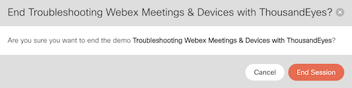

# Logging Out and Ending the Lab Session

Close out of the Chrome Browser
Close out Webex
Close the Windows VM browser tab
Log out of the ThousandEyes and close the incognito browser

In the Webex Demo Toolbox browser tab scroll to the bottom and click **End**

Click **End Session** in the pop up to shutdown the lab and close the tab

<!-- Lastly in the dCloud eXpo Session tab click **Logout and End Session**

 -->

Time to wrap things and with the [Lab Conclusion](./conclusion.md).